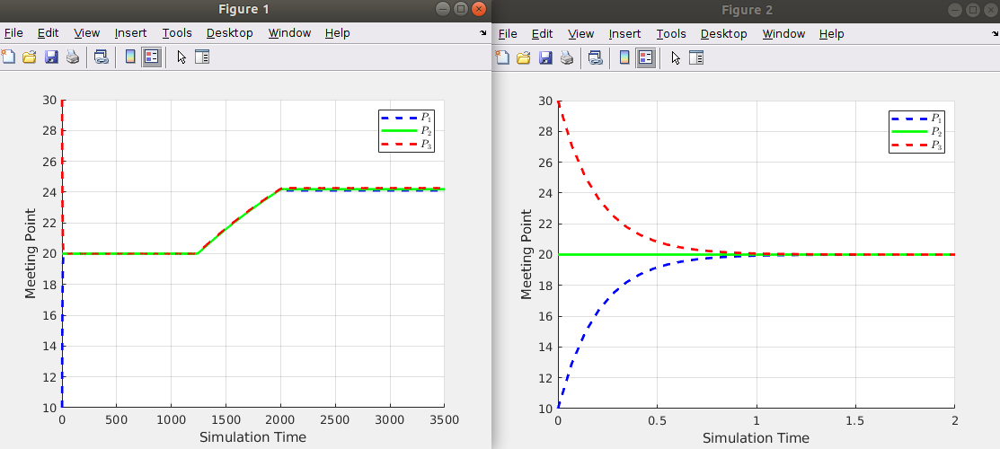
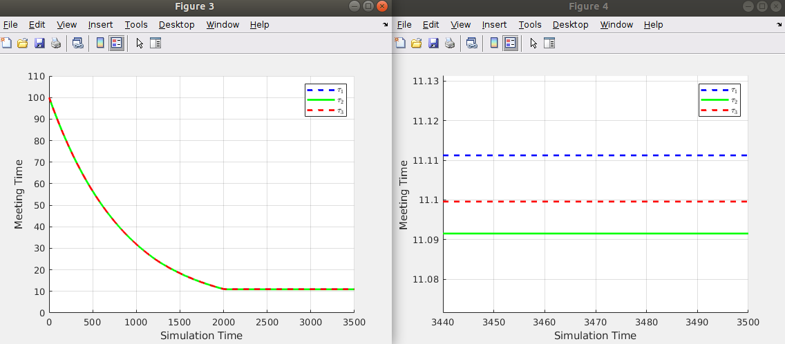
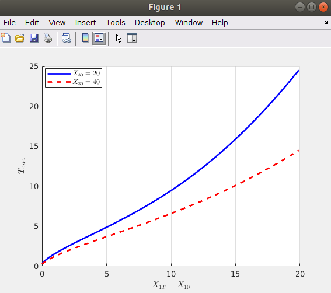
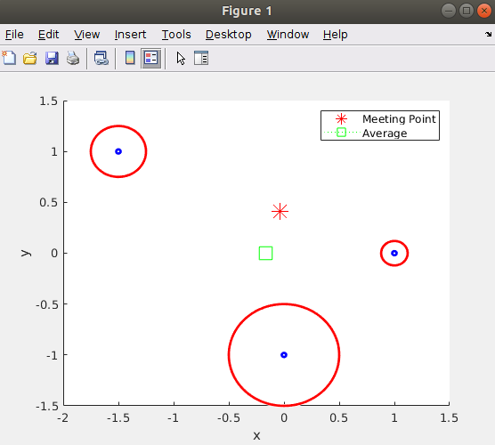

# Energy-Constrained-Coordination-EirProject

<mark>The project has been completed for fulfilment of credits for the *Control of Multi-Robot Systems course* given by *Prof. Andrea Cristofaro*, A.Y. 2020-2021. </mark>

## Results
* Graph depicting meeting position of three robots after optimization (zoomed-in graph for initial 2 seconds on right); 

* Graph depicting meeting time of three robots after optimization (zoomed-in graph from 3440-3500 on right); 

* Graph depicting minimum time to cover the distance increases with increasing distance traveled, as is to be expected. This is intuitive because in order to travel a further distance using the same amount of energy, the robot must travel slower, therefore taking longer. Also, a robot with a higher initial battery level can travel a specified distance in less time than a robot with a lower initial battery level; 

* Graph depicting 2D meeting position of three robots after optimization (also meeting point is different than the average position of the three robots); 
